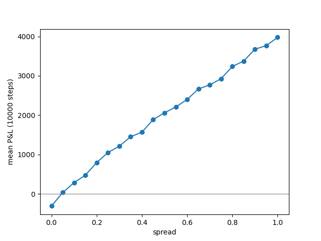

# Toy Market-Making Simulator

A simulation of a market maker quoting a two-sided market against a mix of uninformed
and informed traders, built to understand why a positive spread is not by itself enough to make money.

Written in Python with no dependencies beyond `matplotlib`.

---

## The model

A single asset with a true value `V` that follows a random walk, `V += N(0, sigma)`
each step. The true value is never directly observable by the market maker.

The market maker holds an estimate `M` of fair value which lags the truth by one
step, and quotes symmetrically around it:

```
bid = M - spread/2
ask = M + spread/2
```

One trader arrives per step. With probability `p_informed`, they observe the true
`V` and trade only when the quote is wrong. This means buying if `V > ask` and selling if `V < bid`. Otherwise, they are a noise trader who buys or sells on a coin flip regardless of price.

P&L (profits and losses) is tracked as cash plus inventory marked to the final true value:

```
pnl = cash + inventory * V
```

Default parameters: `sigma = 0.1`, `p_informed = 0.2`, `n = 2000` steps,
averaged over 100 independent runs.

---

## Results

### Adverse selection

Holding the spread fixed and varying the fraction of informed traders:

| `p_informed` | mean P&L (1d.p) | standard error (1d.p) +- |
|---|---|---|
| 0.0 | 536.0 | 31.0 |
| 0.2 | 268.2 | 31.1 |
| 0.4 | 166.9 | 27.4 |
| 0.6 | -71.3 | 27.6 |
| 0.8 | -247.0 | 28.4 |

The market maker's quotes are based on `M`, which is a step behind the true market value `V`. As `p_informed` rises, there is a higher chance that the trader is informed of the current value `V`. This means they won't buy unless they make a profit, and the market maker takes a loss.

Noise traders buy or sell at random, with a 50% chance of doing either, meaning that, on average, they pay the market maker half the spread.

Our P&L is the net of 2 competing forces: gains from noise flow `(1 − p) × spread/2` and losses to informed flow, which is roughly `p × (average amount you're picked off by)`

As `p_informed` rises, the first shrinks and the second rises. In this configuration, we can see that the crossover sits at near `p_informed=0.5`

### Break-even spread

Sweeping the spread from 0 to 1.0 at `p_informed = 0.2`:



At zero spread, the market maker loses money outright. P&L crosses zero at a
spread of approximately 0.06.

### The mistake that taught me most

---

## Limitations

---

## Running it

---

## Next steps

---

## References

- Glosten & Milgrom (1985), *Bid, Ask and Transaction Prices in a Specialist
  Market with Heterogeneously Informed Traders*
- Avellaneda & Stoikov (2008), *High-frequency Trading in a Limit Order Book*
