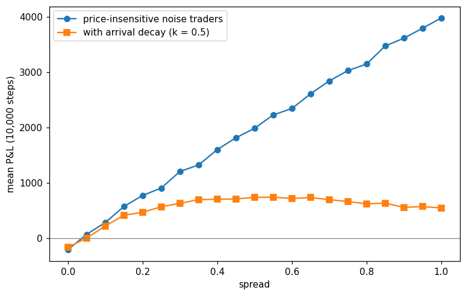
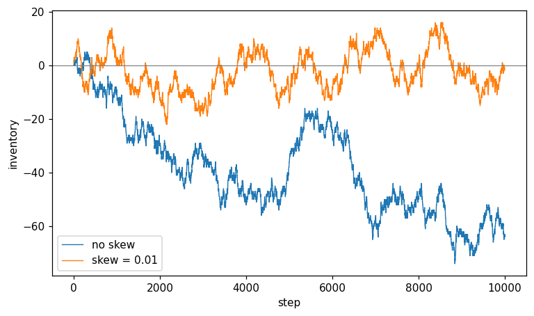
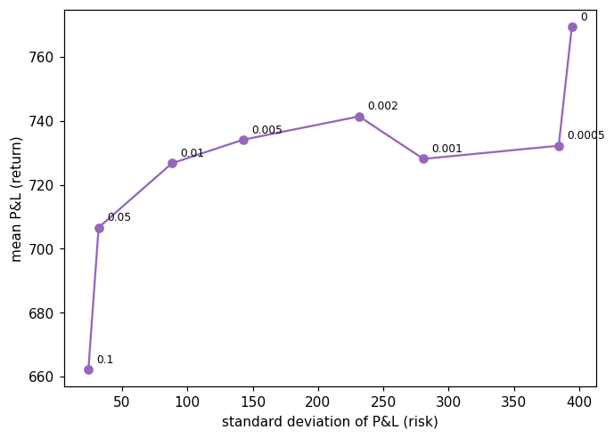

# Toy Market-Making Simulator

A simulation of a market maker quoting a two-sided market against a mix of uninformed
and informed traders, built to understand why a positive spread is not by itself enough to make money.

Written in Python with no dependencies beyond `matplotlib`.

---

## The model

A single asset with a true value `V` that follows a random walk, `V += N(0, sigma)`
each step. The true value is never directly observable by the market maker.

The market maker holds an estimate `M` of fair value which lags the truth by one
step, and quotes symmetrically around it:

```
bid = M - spread/2
ask = M + spread/2
```

One trader arrives per step. With probability `p_informed`, they observe the true
`V` and trade only when the quote is wrong. This means buying if `V > ask` and selling if `V < bid`. Otherwise, they are a noise trader who buys or sells on a coin flip regardless of price.

P&L (profits and losses) is tracked as cash plus inventory marked to the final true value:

```
pnl = cash + inventory * V
```

Default parameters: `sigma = 0.1`, `p_informed = 0.2`, `n = 10000` steps,
averaged over 300 independent runs.

---

## Results

### Adverse selection

Holding the spread fixed and varying the fraction of informed traders:

| `p_informed` | mean P&L (1d.p) | standard error (1d.p) +- |
|---|---|---|
| 0.0 | 500.8 | 38.1 |
| 0.2 | 271.1 | 36.7 |
| 0.4 | 215.0 | 38.3 |
| 0.6 | -22.7 | 36.6 |
| 0.8 | -194.0 | 33.5 |

The market maker's quotes are based on `M`, which is a step behind the true market value `V`. As `p_informed` rises, there is a higher chance that the trader is informed of the current value `V`. This means they won't buy unless they make a profit, and the market maker takes a loss.

Noise traders buy or sell at random, with a 50% chance of doing either, meaning that, on average, they pay the market maker half the spread.

Our P&L is the net of 2 competing forces: gains from noise flow `(1 − p) × spread/2` and losses to informed flow, which is roughly `p × (average amount you're picked off by)`

As `p_informed` rises, the first shrinks and the second rises. In this configuration, at this spread and this sigma, we can see that the crossover sits near `p_informed=0.6`, where P&L is statistically indistinguishable from zero (-22.7 ± 36.6, only 0.6 standard errors below break-even). At `p_informed=0.4` we are clearly profitable and at `p_informed=0.8` clearly loss-making, both by more than 5 standard errors.

### Break-even spread

Sweeping the spread from 0 to 1.0 at `p_informed = 0.2`:


At zero spread, the market maker loses money outright. P&L crosses zero at a
spread of approximately 0.05.

### The mistake that taught me most

In this version, we can see that P&L rises without a limit as the spread increases. The curve has no maximum. However, there is a fundamental flaw with this model. It implies that quoting a spread of 100 on an asset worth 100, i.e buying at 50, selling at 150, is better than any sensible spread. This conclusion is what makes it obvious that this model is broken. 

The model assumes that noise traders will continue to trade regardless of how much you exploit them (that they are price-insensitive), which in reality is not the case. For example, if you sell for an extortionate price, these traders would go elsewhere or not buy at all.

To try to remedy this, I wanted my noise traders to sometimes look at my spread and decline. This means that I wanted the probability of a trade with them to decrease as the spread increases. So right before the coin flip (sells/buys), I added the line `if random.random() < math.exp(-spread / k)`. I used `exp(-spread/k)` since it's a function that is one when the spread is 0 and decays smoothly as the spread widens, as well as ranging from 0 to 1. 

Here k sets how fussy the noise traders are; a lower k means that they are more price sensitive. E.g at `k=0.5` a spread of 0.5 keeps about 37% of the noise traders, whereas a spread of 1.0 keeps 14%.

Now we have 2 competing effects. A wider spread earns more per trade, but fewer trades happen. Our curve now rises, peaks, and falls. One caveat, however, is that this decay function is invented instead of derived. Real order flow elasticity is measured empirically and isn't so predictable.



*Mean P&L against quoted spread, with and without price-sensitive noise traders. With price-insensitive noise traders (blue), P&L grows without bound; the model implies an arbitrarily wide spread is arbitrarily profitable. Adding arrival decay (orange) makes noise traders less likely to trade as the spread widens, producing an interior optimum on a plateau roughly between 0.35 and 0.7. Both curves: p_informed = 0.2, sigma = 0.1, 300 runs of 10,000 steps.*

### Inventory risk and quote skewing

The market maker has no directional view, but trading with whoever arrives
still leaves it holding a position. Inventory follows a random walk, reaching
roughly ±√n units over n steps, and that leftover position is marked against a
price that has itself drifted. This is where the run-to-run variation in P&L
comes from.



*Inventory over a single run, with and without skewing.*

Skewing shifts both quotes against the current position rather than widening
the spread:

M_adjusted = M - skew * inventory

A long position pushes both bid and ask down, making the ask more attractive
and the bid less so, which pulls inventory back toward zero.

At spread = 0.5, k = 0.5, p_informed = 0.2, over 300 runs of 10,000 steps:

| `skew` | mean P&L | std. dev. | +- standard error |
|---|---|---|---|
| 0.0000 | 769.5 | 394.4 | 22.8 |
| 0.0005 | 732.3 | 384.3 | 22.2 |
| 0.0010 | 728.1 | 280.7 | 16.2 |
| 0.0020 | 741.4 | 231.4 | 13.4 |
| 0.0050 | 734.1 | 142.5 | 8.2 |
| 0.0100 | 726.8 | 88.1 | 5.1 |
| 0.0500 | 706.7 | 32.0 | 1.8 |
| 0.1000 | 662.3 | 24.1 | 1.4 |

We can see from this table that the standard deviation falls from 394.4 to 24.1 when we increase skew from 0 to 0.1. This is a result of there being less inventory when skew is higher, which is where most of the standard deviation comes from in P&L since it's multiplied by V. `P&L = cash + inventory * V`. So as we increase skew, inventory is pushed further to 0, and the noisy `inventory * V` term is much less significant. What's left is cash accumulation, which is much steadier run to run. 

We can also see that from 0 to 0.01, the mean is consistent with staying flat; the drop of 42.7 is only 1.8 standard errors, so any cost between these values is theoretically nonzero but below measurement resolution at 300 runs. Only when we increase skew beyond 0.01 do we start to see the mean notably drop. This is interesting because we essentially get a 4.5x reduction in the standard deviation without influencing the mean significantly at a skew of 0.01. 

However, beyond that, further increases in skew cause a reduction in profit. We can see that when comparing a skew of 0.1 to 0, we have a mean P&L of 662.3 versus 769.5. This is a gap of 107 ± 23, about 4.7 standard errors. 

So we can see that at a skew of 0.01 we get most of the risk reduction without measurable cost. 



*Mean P&L against standard deviation of P&L, each point labelled with its skew value. The zigzag between skew 0 and 0.002 is sampling noise rather than structure; those points differ by around one standard error. The trend is clear from 0.005 onwards.*

---

## Limitations

This is a deliberately minimal model built to isolate two mechanisms: adverse selection and inventory risk. The simplifications that make those visible also leave out most of what a real market maker deals with. Below are a few of them.

### Informed traders observe `V` exactly

They know the true value with perfect precision, which makes them maximally dangerous. Real informed traders have a noisy signal, not 100% certainty. 

Consequence: our model overstates adverse selection, so the break-even spread is too wide and the crossover `p` is too low. Also, perfect information means these traders will never trade at a loss, so we never win against them. With noisy signals, we'd sometimes profit from an informed trader who was wrong, which changes the economics.

### Only one market maker

In the model, the market maker (we) choose the spread, and there is no one undercutting us. In reality, competing makers bid the spread down toward the level where profit approximately covers adverse selection and inventory cost. 

Consequence: the "optimal spread" this model finds is a monopolist's answer. In a competitive market, the spread is determined by entry, not chosen. So the question shifts from "what should I quote?" to "what spread does competition produce?"

### No order book, queue or price-time priority

We assume that when a trader arrives and wants to trade, the trade happens against us, at our quoted price. However, in real markets multiple participants post bids and offers at various prices, and then they're queued. First by price (best price wins), then by time (among equal prices, whoever posted first is served first). An incoming market order goes through that queue from the front.

Consequence: real market makers manage queue position, and being early in the queue at a slightly worse price can beat being late at a better one. It also means the model has no concept of partial fills or of being adversely selected because we were at the front when informed flow arrived.

### The noise trader decay function is invented

`exp(-spread/k)` was chosen because it has the right shape (1 at zero spread, decaying, bounded in [0,1]), not because it was measured. Real order flow elasticity is estimated empirically and has no clean closed form. 

Consequence: the location of the optimum depends directly on `k`, which we chose rather than measured. The existence of an interior optimum, however, does not. At a near-zero spread we earn almost nothing per trade; at a very wide spread almost no noise traders arrive, so we barely trade at all. P&L is therefore low at both extremes, and the maximum must sit somewhere between them. This holds for any decreasing arrival function, not just the exponential. So the model does establish that an optimal spread exists, but the particular value it reports is an input rather than a result.

None of these four affects the two conclusions the model supports: that adverse selection alone can make a positive spread unprofitable, and that skewing quotes against inventory trades expected return for a large reduction in variance. Both follow from the mechanisms rather than the particular parameter values, and both would survive in a richer model. Several other simplifications are worth noting but not expanding on. There is no latency, so our quotes update the instant we decide to change them; inventory carries no funding or margin cost, so holding a large position is free, and exactly one trader arrives per step regardless of the spread, volatility, or time of day.

---

## Running it

```bash
pip install matplotlib
python market_maker.py
```

The script prints both results tables and writes all four figures to the working directory. `random.seed(0)` is set at the top, so the output is reproducible — a fresh clone will produce the same numbers and charts shown above.

Parameters are set as constants near the top of the file: `RUNS` controls repetitions per data point and `STEPS` the length of each run. Both are set to the values used throughout this README (300 and 10,000). Lowering them speeds things up considerably at the cost of wider error bars; the full run takes around twenty minutes.

---

## Next steps

The clearest gap in this model is that `M` only updates with the passage of time. It never learns from the trades themselves, yet a trade is information. Someone buying at our ask is weak evidence that the true value sits above our estimate, and a market maker that ignores this is repeatedly picked off by the same signal it could have used to defend itself.

The fix is to nudge `M` toward the side that was hit after each trade, so that repeated buying pulls our estimate upward. This is the Glosten–Milgrom model in its simplest form, where I have not yet read the original, but it would be the natural place to start.

A second direction is competition. With two or more market makers quoting simultaneously and the trader taking the best available price, the spread would no longer be something we choose but something the competition produces — which is closer to how real spreads are set.

---

## Use of AI

Claude was used throughout this project as a tutor and reviewer. It explained concepts such as adverse selection and inventory risk, pointing out bugs in my accounting and sampling, suggesting which experiments to run, and reviewing my write-up for errors. The model, the code and the analysis are my own. Where results are stated, I generated and interpreted them myself.
